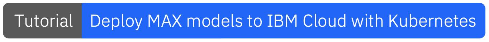
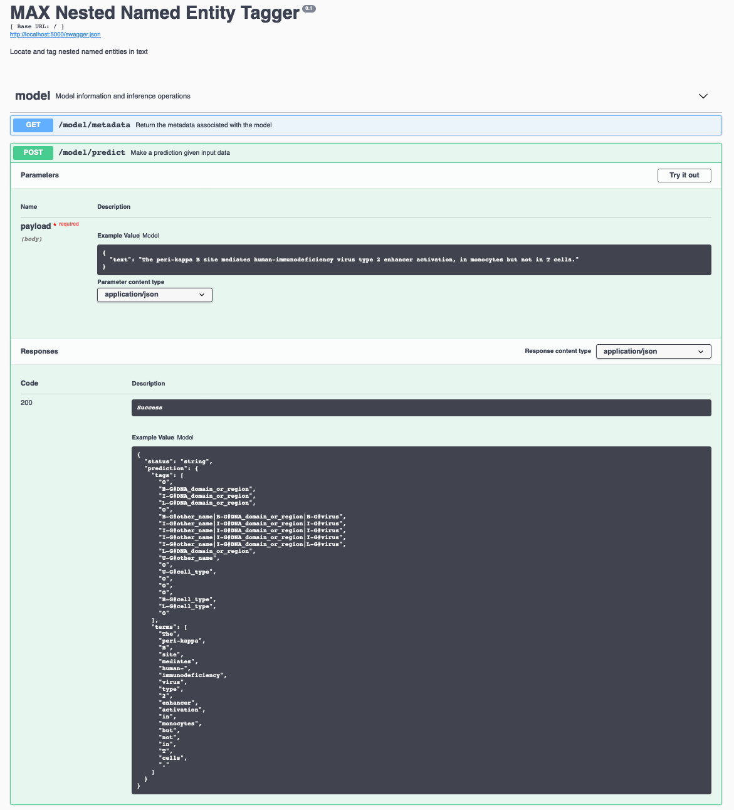

[](https://travis-ci.com/IBM/MAX-Nested-Named-Entity-Tagger) [](http://max-nested-named-entity-tagger.max.us-south.containers.appdomain.cloud/)

[](http://ibm.biz/max-to-ibm-cloud-tutorial)

# IBM Developer Model Asset Exchange: Nested Named Entity Tagger

This repository contains code to instantiate and deploy a nested named entity recognition model. This model annotates each word or term in a piece of text with a tag representing the entity type, taken from a list of 145  entity tags from the [GENIA Term corpus version 3.02](http://www.geniaproject.org/genia-corpus/term-corpus). A detailed list of all entites can be found [here](samples/entites.md)

The model consists of a seq2seq architecture with a bi-directional LSTM layer as an encoder applied to character-level embedding vectors, which are combined with pre-trained [word2vec](http://vectors.nlpl.eu/repository/20/4.zip) and pre-trained binary [FastText](https://fasttext.cc/docs/en/crawl-vectors.html) word vector embeddings; The contextualized embeddings (BERT, ELMo, Flair) have been generated using the [FlairNLP library](https://github.com/flairNLP). The per-token BERT contextualized word embeddings are created as an average of all token corresponding BERT subwords. Under the hoods Flair uses the [pretrained BERT Large Uncased](https://storage.googleapis.com/bert_models/2018_10_18/uncased_L-24_H-1024_A-16.zipFinally) weights.
Finally an LSTM decoder layer is applied to this combined vector representation for generating the named entity tags. The input to the model is a string and the output is a list of terms in the input text (after applying simple tokenization), together with a list of predicted entity tags for each term.

The model architecture is based on the Jana Strakova's [Neural Architectures for Nested NER through Linearization](https://github.com/ufal/acl2019_nested_ner). The model files are hosted on
[IBM Cloud Object Storage](https://s3.us-east.cloud-object-storage.appdomain.cloud/nested-ner-storage/saved_model_nested_ner.tar.gz).
The code in this repository deploys the model as a web service in a Docker container. This repository was developed
as part of the [IBM Developer Model Asset Exchange](https://developer.ibm.com/exchanges/models/) and the public API is powered by [IBM Cloud](https://ibm.biz/Bdz2XM).

## Model Metadata
| Domain | Application | Industry  | Framework | Training Data | Input Data Format |
| ------------- | --------  | -------- | --------- | --------- | -------------- | 
| Natural Language Processing | Nested Named Entity Recognition | BioTech | Tensorflow | [Genia Corpus](http://www.geniaproject.org/genia-corpus/term-corpus) | Text |

## References

* _Jana Strakova´, Milan Straka, Jan Hajic_, ["Neural Architectures for Nested NER through Linearization"](https://www.aclweb.org/anthology/P19-1527.pdf), ACL, 2019.
* [GitHub repository for Neural Architectures for Nested NER through Linearization](https://github.com/ufal/acl2019_nested_ner)
* [GitHub repository for XML to Conll](https://github.com/bryanoliveira/xml2conll)


## Licenses

| Component | License | Link  |
| ------------- | --------  | -------- |
| This repository | [Apache 2.0](https://www.apache.org/licenses/LICENSE-2.0) | [LICENSE](LICENSE) |
| Model Weights | [Apache 2.0](https://www.apache.org/licenses/LICENSE-2.0) | [LICENSE](LICENSE) |
| Model Code (3rd party) | [Mozilla Public 2.0](https://www.mozilla.org/en-US/MPL/2.0/) | [LICENSE](LICENSE) |
| Test samples | [Apache 2.0](https://www.apache.org/licenses/LICENSE-2.0) | [LICENSE](LICENSE) | [samples README](samples/README.md) |

## Pre-requisites:

* `docker`: The [Docker](https://www.docker.com/) command-line interface. Follow the [installation instructions](https://docs.docker.com/install/) for your system.
* The minimum recommended resources for this model is 12 GB Memory and 4 CPUs.

# Deployment options

* [Deploy from Quay](#deploy-from-quay)
* [Deploy on Red Hat OpenShift](#deploy-on-red-hat-openshift)
* [Deploy on Kubernetes](#deploy-on-kubernetes)
* [Run Locally](#run-locally)

## Deploy from Quay

To run the docker image, which automatically starts the model serving API, run:

```shell
$ docker run -it -p 5000:5000 quay.io/codait/max-nested-named-entity-tagger
```

This will pull a pre-built image from the Quay.io container registry (or use an existing image if already cached locally) and run it. If you'd rather checkout and build the model locally you can follow the [run locally](#run-locally) steps below.

## Deploy on Red Hat OpenShift

You can deploy the model-serving microservice on Red Hat OpenShift by following the instructions for the OpenShift web console or the OpenShift Container Platform CLI [in this tutorial](https://developer.ibm.com/tutorials/deploy-a-model-asset-exchange-microservice-on-red-hat-openshift/), specifying `quay.io/codait/max-nested-named-entity-tagger` as the image name.

## Deploy on Kubernetes

You can also deploy the model on Kubernetes using the latest docker image on Quay.

On your Kubernetes cluster, run the following commands:

```shell
$ kubectl apply -f https://github.com/IBM/MAX-Nested-Named-Entity-Tagger/raw/master/max-nested-named-entity-tagger.yaml
```

The model will be available internally at port `5000`, but can also be accessed externally through the `NodePort`.

A more elaborate tutorial on how to deploy this MAX model to production on [IBM Cloud](https://ibm.biz/Bdz2XM) can be found [here](http://ibm.biz/max-to-ibm-cloud-tutorial).

## Run Locally

1. [Build the Model](#1-build-the-model)
2. [Deploy the Model](#2-deploy-the-model)
3. [Use the Model](#3-use-the-model)
4. [Development](#4-development)
5. [Cleanup](#5-cleanup)


### 1. Build the Model

Clone this repository locally. In a terminal, run the following command:

```shell
$ git clone https://github.com/IBM/MAX-Nested-Named-Entity-Tagger.git
```

Change directory into the repository base folder:

```shell
$ cd MAX-Nested-Named-Entity-Tagger
```

To build the docker image locally, run: 

```shell
$ docker build -t max-nested-named-entity-tagger .
```

All required model assets will be downloaded during the build process. _Note_ that currently this docker image is CPU only (we will add support for GPU images later).


### 2. Deploy the Model

To run the docker image, which automatically starts the model serving API, run:

```shell
$ docker run -it -p 5000:5000 codait/max-nested-named-entity-tagger
```

### 3. Use the Model

The API server automatically generates an interactive Swagger documentation page. Go to `http://localhost:5000` to load it. From there you can explore the API and also create test requests.

[Use the `model/predict` endpoint to post text and get predicted tags from the API. Below are a few example sentences you can use:]

```
The peri-kappa B site mediates human-immunodeficiency virus type 2 enhancer activation, in monocytes but not in T cells.

Peroxisome proliferator-activated receptor activators human endothelial cells to inhibit leukocyte-endothelial cell interaction.

In conclusion, these data show that IL-10 induces c-fos  expression in human by activation of tyrosine   and serine/threonine kinases.
```




You can also test it on the command line, for example:

```
$ curl -X POST -H 'Content-Type: application/json' -d '{"text":"The peri-kappa B site mediates human-immunodeficiency virus type 2 enhancer activation, in monocytes but not in T cells."}' 'http://localhost:5000/model/predict'
```

You should see a JSON response like that below:

```json
{
  "status": "ok",
  "predictions": {
      "entities": [
            "O",
            "B-G#DNA_domain_or_region",
            "I-G#DNA_domain_or_region",
            "L-G#DNA_domain_or_region",
            "O",
            "B-G#other_name|B-G#DNA_domain_or_region|B-G#virus",
            "I-G#other_name|I-G#DNA_domain_or_region|I-G#virus",
            "I-G#other_name|I-G#DNA_domain_or_region|I-G#virus",
            "I-G#other_name|I-G#DNA_domain_or_region|I-G#virus",
            "I-G#other_name|I-G#DNA_domain_or_region|L-G#virus",
            "L-G#DNA_domain_or_region",
            "U-G#other_name",
            "O",
            "U-G#cell_type",
            "O",
            "O",
            "O",
            "B-G#cell_type",
            "L-G#cell_type",
            "O"
        ],
        "input_terms": [
            "The",
            "peri-kappa",
            "B",
            "site",
            "mediates",
            "human-",
            "immunodeficiency",
            "virus",
            "type",
            "2",
            "enhancer",
            "activation",
            "in",
            "monocytes",
            "but",
            "not",
            "in",
            "T",
            "cells",
            "."
        ]

  }
}
```

### 4. Development

> Please remember to set `DEBUG = False` when publishing the model. 

To run the Flask API app in debug mode, edit `config.py` to set `DEBUG = True` under the application settings. You will then need to rebuild the docker image (see [step 1](#1-build-the-model)).

### 5. Cleanup

To stop the Docker container, type `CTRL` + `C` in your terminal.
